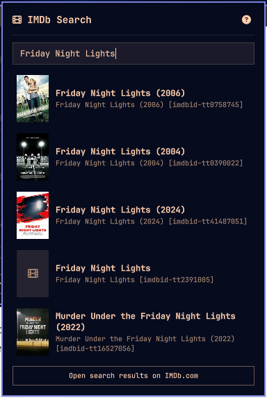
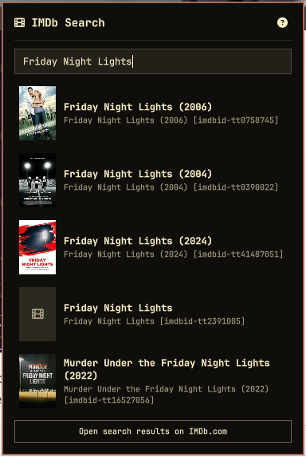
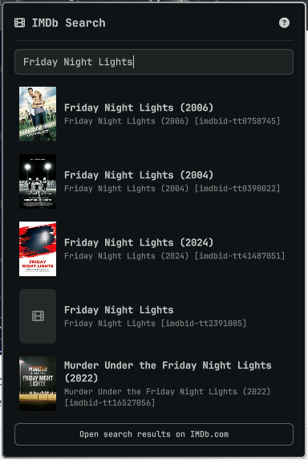

# IMDb Search

Search movies and TV shows from the [Omarchy](https://omarchy.org/) bar and
get a ready-made `Title (Year) [imdbid-ttXXXXXXX]` folder name — the
folder syntax most media libraries expect. No API key, no signup, no
configuration.

Click the bar icon, type at least 2 characters, and the top 5 matches
appear with poster, title, year, and folder name, with an "Open search
results on IMDb.com" link below the search results.

[](preview.png)

The `?` icon in the top-right corner of the panel toggles a reminder of
the mouse and keyboard shortcuts below the search field.

| Action | Effect |
|---|---|
| Left click a result / <kbd>Enter</kbd> | Open the title on IMDb in your browser |
| Right click a result / <kbd>Space</kbd> | Copy its folder name to the clipboard |
| <kbd>↓</kbd> / <kbd>↑</kbd> | Select the next/previous result |
| <kbd>Esc</kbd> | Close the panel |

`↓`/`↑` also work from the search field itself: `↓` selects the first
result, `↑` jumps straight to the "Open search results" button at the
bottom (Enter/Space activates it too). Pressing `↑` from the first
result, or `↓` from the button, returns to typing.

## Install

Requires Omarchy 4 or later (the plugin system this relies on isn't
available in earlier versions).

```bash
omarchy plugin add https://github.com/andersdosen/omarchy-imdbsearch.git --enable
```

You'll be prompted to pick a bar section (left/center/right) for the icon.

The shell picks up the plugin without a restart — edits under
`~/.config/omarchy/plugins/` hot-reload automatically.

## How it works

Search runs against IMDb's own (unofficial) suggestion endpoint — the same
one IMDb.com's search box uses — so there's no API key, no rate limit to
hit, and no signup step. Because it's unofficial, IMDb could change or
remove it without notice; if search stops returning results, that's the
most likely reason.

Folder names replace `/` in the title with `-` (so it reads as a
separator rather than vanishing, e.g. "Face/Off" → "Face-Off"), strip the
rest of the characters that aren't valid on a filesystem
(`: \ * ? " < > |`), and append `(Year) [imdbid-ttXXXXXXX]`.

## Language

The UI follows your system language automatically (via `Qt.locale()`).
Currently translated: English, Norwegian Bokmål (`nb`), German (`de`),
French (`fr`), Spanish (`es`), Portuguese (`pt`), Swedish (`sv`), Italian
(`it`), and Finnish (`fi`). Any string not yet translated in your
language falls back to English. To add a language, add a
`languages.<code>` entry to [`Strings.js`](Strings.js) with the same
keys as `en` — see the comment at the top of that file. Pull requests
adding new languages are welcome.

The `de`, `fr`, `es`, `pt`, `sv`, `it`, and `fi` translations are
AI-generated and haven't been reviewed by a native speaker, so wording
may be imperfect. Corrections are welcome as pull requests.

## Theming

Colors, fonts, and spacing all follow your active Omarchy theme — the
panel reads the same bar foreground color, accent, and font as the rest
of the shell, so it re-themes automatically when you switch themes, no
restart needed. Same search, three themes:

<table>
<tr>
<td align="center"><a href="docs/preview-ethereal.png"></a><br>Ethereal <small>by Bjarne Øverli</small></td>
<td align="center"><a href="docs/preview-diablo-dreams.png"></a><br><a href="https://github.com/dhh/omarchy-diablo-dreams-theme">Diablo Dreams</a> <small>by DHH</small></td>
<td align="center"><a href="docs/preview-solitude.png"></a><br><a href="https://github.com/HANCORE-linux/omarchy-solitude-theme">Solitude</a> <small>by HANCORE</small></td>
</tr>
</table>

## Data & privacy

- Search queries go to `sg.media-imdb.com`; title metadata comes back from
  IMDb's public suggest endpoint.
- Posters load from IMDb's own image CDN (`m.media-amazon.com`), resized
  to a small thumbnail, and are cached to disk under
  `$XDG_CACHE_HOME/omarchy-imdbsearch/posters/` (`~/.cache/...` if unset)
  so a repeat search doesn't re-fetch them.
- Opening a result uses your default browser (`omarchy-launch-browser`);
  copying a folder name uses `wl-copy`.
- Not affiliated with, endorsed by, or sponsored by IMDb.com, Inc. or
  Amazon.

## Uninstall

```bash
omarchy plugin remove andersdosen.imdbsearch
```

## License

MIT — see [LICENSE](LICENSE).
